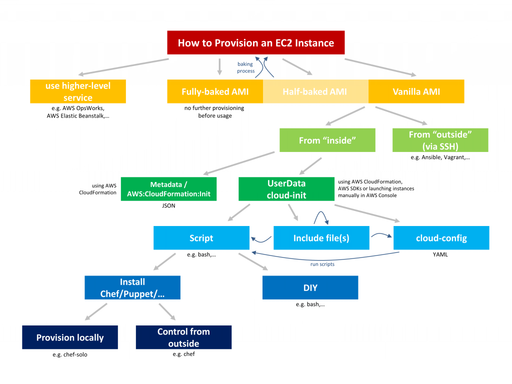

#How to Provision an EC2 Instance
###AWS DevOps Infrastructure as Code CloudFormation

***

There are many ways how to provision an EC2 instance. And with "provision" I mean "getting everything ready" by installing and configuring all required software and your build in an automated, reproducible way - no, launching an EC2 instance in the AWS Console, logging in via SSH and manually installing Apache and then do a git clone is not "provisioning"...

Also, in this post I'm not focusing on the deployment portion (but if you do, you should look into AWS CodeDeploy. In fact I like the concept of a server being "immutable", which means whenever you need to make any change (including deploying a new version of your project) you spin up new instances and throw away the old ones. Among many advantages one very nice side-effect of this concept is that you never have to take the current state of an instance into account since you always start from scratch (or at least from a clearly-defined starting point). But that's a different story.

In this post let me help you navigate the jungle of options available on how to provision a EC2 instance:

**Use higher-level service**

The easiest option is to use a higher-lever service like Elastic Beanstalk or AWS OpsWorks where everything is already being taken care of. AWS OpsWorks not only uses Chef and allows you to customize (almost) everything, but it also comes with a simple concept for a layered architecture and a concept of deploying builds to your app layer.

But let's look at the other options in case you're only looking to provision instances (and not the full infrastructure) or if OpsWorks or Elastic Beanstalk are too opinionated for you (and you don't share their opinions... :)

**Fully-baked AMI**

A "fully-baked" AMI is a "instance blueprint" that comes with everything you need INCLUDING the current version of your application. In this case you most likely bake the AMI as part of your CI/CD pipeline and after booting an EC2 instance with this image no further provisioning happens and the instance is ready to use.

But of course the process of preparing the images ("baking") involves some provisioning, so all the other options here are still relevant. They just happen at a different point in time in your development and deployment workflows.

**Half-baked AMI**

The "half-baked" AMI is a compromise between "fully-baked" and "not baked". You'd still provision everything you need on the images except for the build. This way you can reuse the same AMI for all your builds (unless you make changes to the server instance itself) and deploy and install the build after booting. Again, the following options still apply during your baking process and in addition you also need to have a concept in place of how to get the build deployed and installed.

**Vanilla AMI**

Using a vanilla AMI to get started is easier since you don't have to deal with baking your own AMI and managing them. On the downside booting your instance might take significantly longer and with much more "moving parts" there's a higher risk that something might fail.

However, let's assume we're starting with a vanilla AMI since that's what you have to do in any case at one point or the other.

**From "outside"**

One option is to boot an EC2 instance and then log in via SSH to do the rest. This is how tools like Ansible and Vagrant work.

The information what needs to be done lives outside of the box and the provisioning process is therefore "remote controlled". Usually it's the same tool also spining up the EC2 instance in the first place and making sure a key is in place that allows the tool to access the instance later.

**From "inside"**

AWS offers mechanisms to provision EC2 instances as part of your boot process. Let's have a close look:

**AWS:CloudFormation:Init**

In case you're using CloudFormation to set up your infrastructure you can add some declarative provisioning instructions as part of your AWS::EC2::Instance or AWS::AutoScaling::LaunchConfiguration's Metadata.

Here's a basic template taken from the documentation:

"Resources": {
  "MyInstance": {
    "Type": "AWS::EC2::Instance",
    "Metadata" : {
      "AWS::CloudFormation::Init" : {
        "config" : {
          "packages" : {},
          "groups" : {},
          "users" : {},
          "sources" : {},
          "files" : {},
          "commands" : {},
          "services" : {}
        }
      }
    },
    "Properties": {
      [...]
    }
  }
}

**cloud-init**

An alternative to AWS:CloudFormation:Init is cloud-init which lives in the UserData field (instead of in the Metadata). cloud-init is not restricted to CloudFormation but can be set wherever you can launch an EC2 instance:

    CloudFormation
    AWS SDKs
    AWS CLI
    AWS Console

Cloud-init is not specific to AWS, but is handled in EC2 and the Amazon Linux distribution supports it (in addition to some other Linux distributions like Ubuntu...):

    "The cloud-init package is an open source application built by Canonical that is used to bootstrap Linux images in a cloud computing environment, such as Amazon EC2. Amazon Linux contains a customized version of cloud-init." (http://docs.aws.amazon.com/AWSEC2/latest/UserGuide/AmazonLinuxAMIBasics.html#CloudInit)

Cloud-init comes in different "flavors" depending on your Linux distribution. Check out the corresponding documentation:

    https://cloudinit.readthedocs.org/en/latest/
    Amazon Linux: http://docs.aws.amazon.com/AWSEC2/latest/UserGuide/user-data.html
    Ubuntu: https://help.ubuntu.com/community/CloudInit

Cloud-init writes all its output to /var/log/cloud-init.log. Check this out in case your provisioning scripts don't work like you expect.

The UserData field that holds the cloud-init content is base64 encoded. Embedding it via a CloudFormation template can be done using some helper methods:

"UserData": {"Fn::Base64": {"Fn::Join" : ["", [
    "#!/bin/bash -xe\n",
    "echo \"Hello World\"\n"
]]}}

If you have an existing script and you want to "convert" it into JSON for CloudFormation (including correct escaping) this one-liner might be useful for you:

<?php echo '{"Fn::Base64": {"Fn::Join": ["\n", ' . 
json_encode(file($argv[1], FILE_IGNORE_NEW_LINES), JSON_PRETTY_PRINT) .
']}}';

There's a couple of different things you can do with Cloud-init. Let's have a closer look:

**Include file(s)**

You can include one or more files. Every file is parsed the same way the UserData is parsed. So you can include more files, run scripts or use cloud-config YAML in those files.

 #include http://example.com/setup.sh

**cloud-config**

If your UserData starts with #cloud-config the following block is parsed as YAML. Cloud-config again is a declarative format (that also allows running scripts) helping you to install packages, create files, setup users and services,...

Please note:

    "The Amazon Linux version of cloud-init does not support all of the directives that are available in the base package, and some of the directives have been renamed (such as repo_update instead of apt-upgrade)." http://docs.aws.amazon.com/AWSEC2/latest/UserGuide/user-data.html

Example:

 #cloud-config
packages:
  - apache2
  - libapache2-mod-php5
runcmd:
  - "echo '<?php echo \"Hello, World!\";' > /var/www/html/index.php"

Find a lot more examples here: Examples: http://bazaar.launchpad.net/~cloud-init-dev/cloud-init/trunk/files/head:/doc/examples/
Script

If your UserData starts with #! the content is considered a script (and run as root). It's up to you to do whatever you need to do.

Example:

   #!/bin/bash
   export DEBIAN_FRONTEND=noninteractive
   apt-get update && apt-get -y --force-yes install lamp-server^
   echo '<?php phpinfo(); ?>' > /var/www/html/phpinfo.php

**Install Chef/Puppet/...**

If you prefer using Chef, Puppet or another tool this (or cloud-config, or AWS:CloudFormation:Init) would be the place to install the agent. Here's some documentation on how to use Chef: https://s3.amazonaws.com/cloudformation-examples/IntegratingAWSCloudFormationWithOpscodeChef.pdf and here are bootstrap scripts for Puppet: https://github.com/hashicorp/puppet-bootstrap

**Provision locally / Control from outside**

Depending on your preference you could use Chef-Solo (or chef-client's local mode) to make your instances boot process self-contained or reach out to a Chef Server (or something else) in order to manage this instance (and the complete lifecycle) remotely.
